<p align="center">
  
</p>

`anchorCorrectR` removes technical batch effects when the same biological samples
(or known replicates) are measured in more than one batch. Those cross-batch
replicates act as **anchors**: the package estimates per-batch shifts from them
and applies the correction to all samples.

Methods: location shift (mean/median), ridge, and anchor-aware ComBat. Works on
counts or log-scale matrices, with assessment helpers and **extended utilities
for QC**. The SEQC example below also benchmarks `sva::ComBat_seq` (external).

## Why anchors?

Standard methods estimate batch effects from all samples. When biology and batch
are confounded, that can remove real signal. Anchors compare **the same
biological sample** across batches, isolating technical shift more cleanly -
especially with unbalanced or partially confounded designs.

## Installation

```r
# install.packages("remotes")
remotes::install_github("bioinfoUGR/AnchorCorrectR")
# BiocManager::install("anchorCorrectR")  # after Bioconductor acceptance
```

**Imports:** `stats`, `utils`

**Suggested:** `glmnet`, `ggplot2`, `FNN`, `edgeR`, `dplyr`,
`tibble`, `tidyr`, `patchwork`, `scales`, `vcfR`, `foreach`, `doParallel`,
`parallel`, `ShortRead`, `Matrix`, `sva`, `BiocStyle`, `knitr`, `rmarkdown`,
`testthat`

```r
if (!requireNamespace("BiocManager", quietly = TRUE)) install.packages("BiocManager")
BiocManager::install(c("ShortRead", "edgeR", "sva"))
```

## Quick start

```r
library(anchorCorrectR)

corrected <- anchor_correct(
  x = counts, batch = batch, sample_id = sample_id,
  method = "shift",   # also "ridge" or "combat" (anchor-aware ComBat)
  center = "mean",    # or "median" (shift only)
  input_type = "counts"
)
# Output is in the same scale as the input (counts or log).
```

## Example dataset (SEQC / GSE47774)

| File | Content |
|------|---------|
| `inst/extdata/counts.tsv.gz` | genes × samples counts |
| `inst/extdata/metadata.tsv.gz` | sample annotations |

| Column | Role |
|--------|------|
| `Platform` | **Batch** (`ILLUMINA` vs `ABI_SOLID`) |
| `Sample` | **Biology** (`A`, `B`, `C`, `D`) |
| `IDR` | Replicate ID (C/D on both platforms → **anchors**) |
| `ID` | GEO accession (= count matrix columns) |

Default design: **5** cross-platform C/D IDRs (10 libraries) + **30** A/B
libraries. Change `scenario` for A/B platform balance, or the replicate
section below for 2 / 3 / 5 / 10 IDRs.

### Load, correct, assess

```r
library(anchorCorrectR)

counts <- as.matrix(read.delim(
  system.file("extdata", "counts.tsv.gz", package = "anchorCorrectR"),
  row.names = 1, check.names = FALSE
))
meta <- read.delim(
  system.file("extdata", "metadata.tsv.gz", package = "anchorCorrectR"),
  check.names = FALSE
)
stopifnot(identical(colnames(counts), meta$ID))

set.seed(123)
cd <- meta[meta$Sample %in% c("C", "D"), ]
cd_anchor_ids <- names(which(tapply(cd$Platform, cd$IDR, function(z) {
  all(c("ILLUMINA", "ABI_SOLID") %in% z)
})))
keep_idr <- sample(cd_anchor_ids, 5)          # C9, D12, C8, C11, C4
meta_cd <- cd[cd$IDR %in% keep_idr, ]

scenario <- "balanced"  # "balanced", "mild", "strong", "confounded"
pick_ab <- function(meta_ab, sample_label, n_ilm, n_solid) {
  ilm <- meta_ab$ID[meta_ab$Sample == sample_label & meta_ab$Platform == "ILLUMINA"]
  sol <- meta_ab$ID[meta_ab$Sample == sample_label & meta_ab$Platform == "ABI_SOLID"]
  c(sample(ilm, n_ilm), sample(sol, n_solid))
}
ab <- meta[meta$Sample %in% c("A", "B"), ]
ids_ab <- switch(
  scenario,
  balanced   = c(pick_ab(ab, "A", 8, 7),  pick_ab(ab, "B", 8, 7)),
  mild       = c(pick_ab(ab, "A", 11, 4), pick_ab(ab, "B", 11, 4)),
  strong     = c(pick_ab(ab, "A", 14, 1), pick_ab(ab, "B", 14, 1)),
  confounded = c(pick_ab(ab, "A", 15, 0), pick_ab(ab, "B", 0, 15))
)
meta_use <- rbind(meta_cd, ab[ab$ID %in% ids_ab, ])
meta_use <- meta_use[match(intersect(meta_use$ID, colnames(counts)), meta_use$ID), ]
counts_use <- counts[, meta_use$ID, drop = FALSE]
batch <- factor(meta_use$Platform)
biology <- factor(meta_use$Sample)
sample_id <- factor(meta_use$IDR)

out_shift  <- anchor_correct(counts_use, batch, sample_id, method = "shift",
                             center = "mean", input_type = "counts",
                             ref_batch = "ILLUMINA", verbose = FALSE)
out_ridge  <- anchor_correct(counts_use, batch, sample_id, method = "ridge",
                             input_type = "counts", ref_batch = "ILLUMINA",
                             verbose = FALSE)
out_combat <- anchor_correct(counts_use, batch, sample_id, method = "combat",
                             input_type = "counts", ref_batch = "ILLUMINA",
                             verbose = FALSE)
out_combatseq <- sva::ComBat_seq(
  counts_use, batch = as.character(batch), group = as.character(biology)
)
storage.mode(out_combatseq) <- "double"
dimnames(out_combatseq) <- dimnames(counts_use)

assess <- function(x) assess_correction(
  counts_use, x, batch, biology, sample_id,
  input_type = "counts", verbose = FALSE
)
merged <- merge_assessments(
  assess(out_shift), assess(out_ridge), assess(out_combat), assess(out_combatseq),
  run_names = c("shift", "ridge", "combat", "combatseq")  # combat = anchor-aware ComBat
)
merged$consolidated_table

plot_mds_before_after(counts_use, out_shift, batch, biology, input_type = "counts",
                      title = "MDS before vs after — shift · balanced")
```

### Metrics

| Metric | Meaning |
|--------|---------|
| **PVCA batch / biology** | Platform vs Sample variance (want batch ↓, biology ↑ or stable) |
| **Anchor RMSE** | Cross-platform C/D distance (should ↓) |
| **kNN Jaccard / HVG / ARI** | Structure concordance before vs after |

### Results (5 anchors)

`set.seed(123)` → anchors **C9, D12, C8, C11, C4**. Values from
`assess_correction()` on log1p-CPM.

| Scenario | Method | Batch before → after | Biology before → after | RMSE before → after | kNN | HVG |
|----------|--------|----------------------|------------------------|---------------------|-----|-----|
| balanced | shift | 0.204 → 0.036 | 0.582 → 0.675 | 0.594 → **0.289** | 0.818 | 0.944 |
| balanced | ridge | 0.204 → 0.028 | 0.582 → 0.676 | 0.594 → 0.304 | 0.792 | 0.947 |
| balanced | anchor-aware ComBat | 0.204 → 0.026 | 0.582 → 0.678 | 0.594 → 0.298 | 0.786 | 0.946 |
| balanced | ComBat_seq | 0.204 → **0.003** | 0.582 → 0.672 | 0.594 → 0.290 | 0.669 | 0.949 |
| mild | shift | 0.184 → 0.058 | 0.632 → 0.708 | 0.594 → 0.289 | 0.891 | 0.957 |
| mild | ridge | 0.184 → 0.043 | 0.632 → 0.714 | 0.594 → 0.305 | 0.886 | 0.961 |
| mild | anchor-aware ComBat | 0.184 → 0.040 | 0.632 → 0.716 | 0.594 → 0.298 | 0.886 | 0.960 |
| mild | ComBat_seq | 0.184 → **0.006** | 0.632 → 0.690 | 0.594 → **0.286** | 0.806 | 0.968 |
| strong | shift | 0.102 → 0.048 | 0.721 → **0.752** | 0.594 → **0.289** | 0.953 | 0.984 |
| strong | ridge | 0.102 → 0.039 | 0.721 → 0.756 | 0.594 → 0.304 | 0.948 | 0.985 |
| strong | anchor-aware ComBat | 0.102 → 0.036 | 0.721 → 0.758 | 0.594 → 0.298 | 0.948 | 0.985 |
| strong | ComBat_seq | 0.102 → **0.010** | 0.721 → **0.666** | 0.594 → 0.291 | 0.883 | 0.971 |
| confounded | shift | 0.705 → 0.700 | 0.705 → 0.700 | 0.594 → 0.289 | 0.809 | 0.751 |
| confounded | ridge | 0.705 → 0.701 | 0.705 → 0.701 | 0.594 → 0.305 | 0.854 | 0.812 |
| confounded | anchor-aware ComBat | 0.705 → 0.694 | 0.705 → 0.694 | 0.594 → 0.298 | 0.863 | 0.789 |
| confounded | ComBat_seq | 0.705 → 0.696 | 0.705 → 0.696 | 0.594 → **0.285** | 0.837 | 0.764 |

- **Balanced / mild:** all methods cut batch variance; `ComBat_seq` strongest on
  batch but lowest kNN Jaccard.
- **Strong:** anchor methods raise biology variance; `ComBat_seq` drops it
  (0.721 → 0.666).
- **Confounded:** PVCA stuck (~0.70) for everyone; C/D RMSE still improves.

### MDS (color = platform, shape = Sample)

Each figure has an overall title and **before** / **after** panel titles.
Plot styling matches the extended QC utilities (`theme_bw`, light grid,
`skyblue4`/`tomato3`-style discrete colors, point size 2.5 / alpha 0.7).

**Balanced**

<p align="center">
  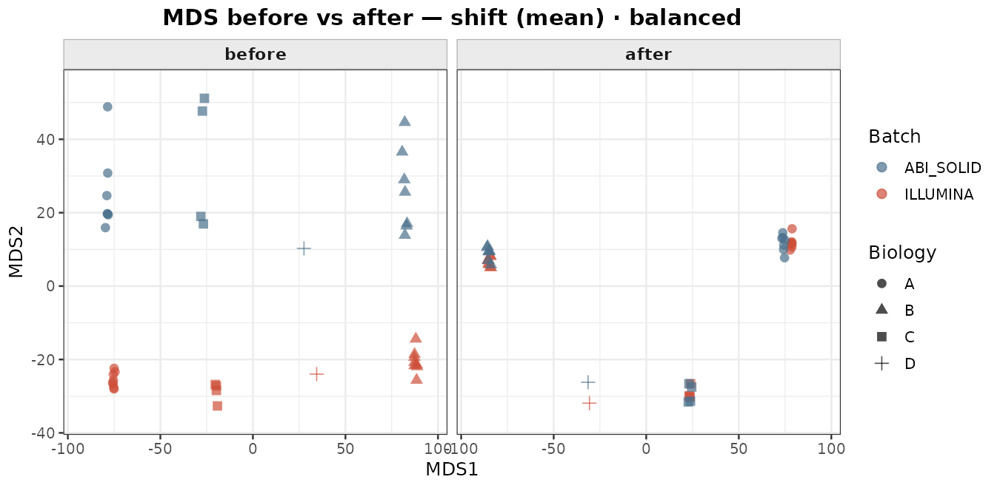
</p>
<p align="center">
  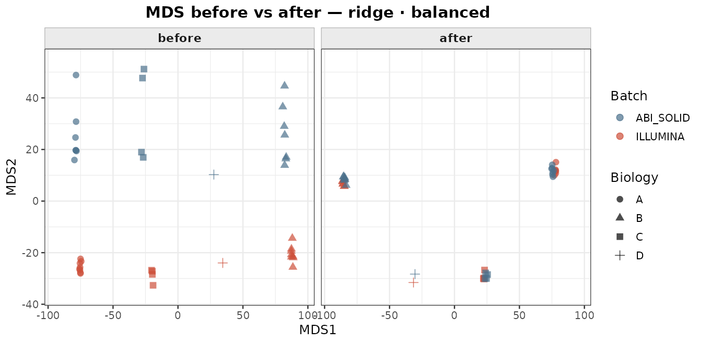
</p>
<p align="center">
  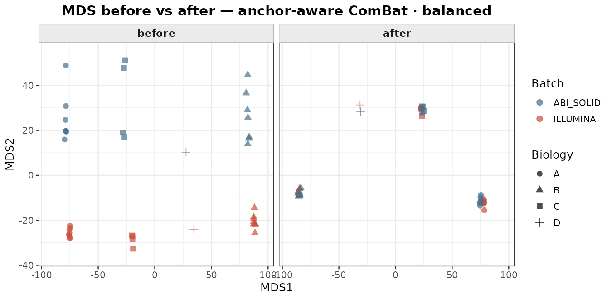
</p>
<p align="center">
  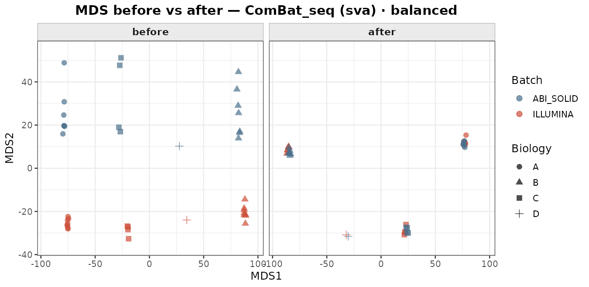
</p>

**Strong (shift vs ComBat_seq)**

<p align="center">
  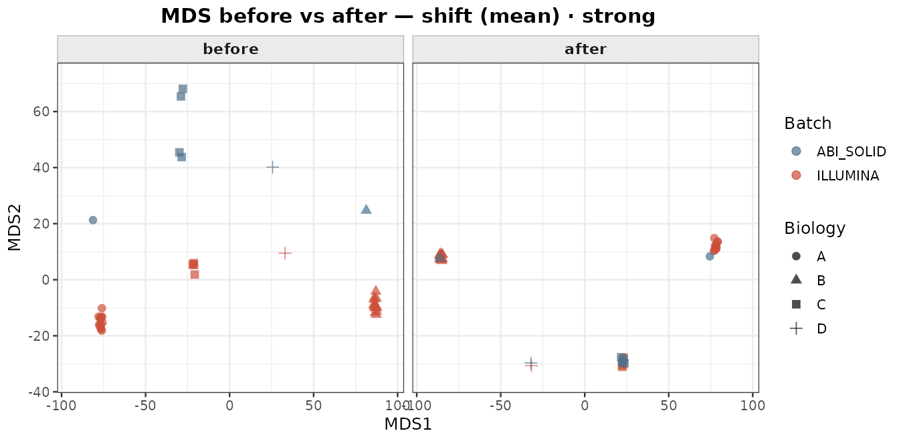
</p>
<p align="center">
  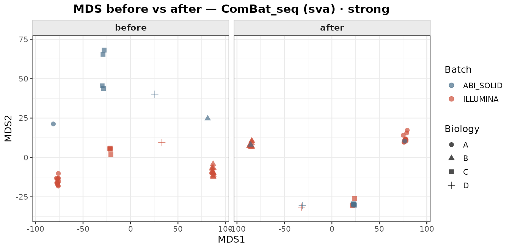
</p>

**Confounded (shift, ridge, ComBat_seq)**

<p align="center">
  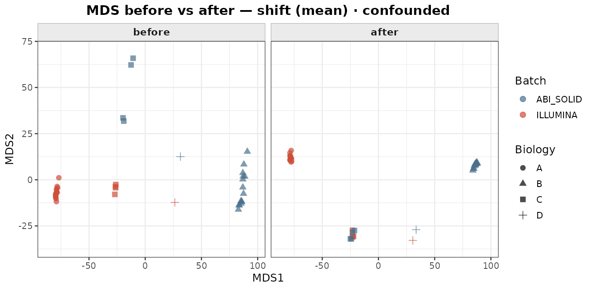
</p>
<p align="center">
  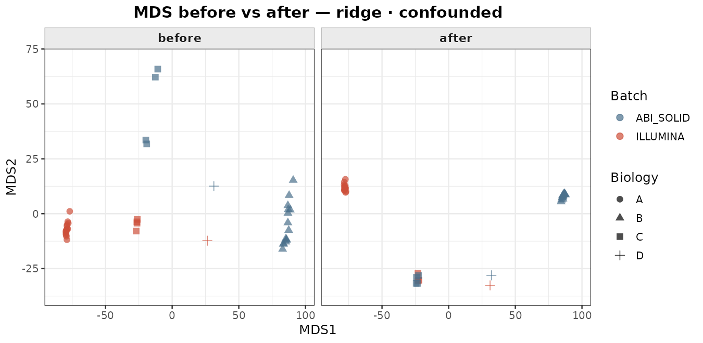
</p>
<p align="center">
  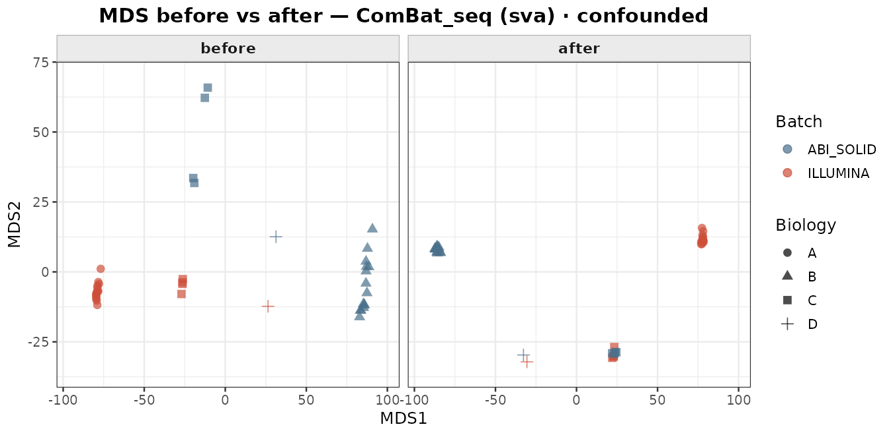
</p>

### Number of replicates (strong imbalance)

**n = number of cross-platform replicates** (not libraries). Nested C/D pools
(`set.seed(123)`): C `C9,C11,C8,C4,C10`, D `D14,D5,D13,D12,D9`.

| n | Composition | Libraries |
|---|-------------|-----------|
| **2** | **1C + 1D** | 4 |
| 3 | 2C + 1D | 6 |
| 5 | 3C + 2D | 10 |
| 10 | 5C + 5D | 20 |

```r
# Reuse strong meta_ab from above; replace meta_cd:
set.seed(123)
c_ids <- sample(cd_anchor_ids[grepl("^C", cd_anchor_ids)], 5)
d_ids <- sample(cd_anchor_ids[grepl("^D", cd_anchor_ids)], 5)
n_replicates <- 2
n_c <- c("2"=1, "3"=2, "5"=3, "10"=5)[as.character(n_replicates)]
n_d <- c("2"=1, "3"=1, "5"=2, "10"=5)[as.character(n_replicates)]
keep_idr <- c(c_ids[seq_len(n_c)], d_ids[seq_len(n_d)])  # n=2 -> 1C+1D
```

| n | Method | Batch before → after | Biology before → after | RMSE before → after | kNN | HVG |
|---|--------|----------------------|------------------------|---------------------|-----|-----|
| 2 (1C+1D) | shift | 0.127 → 0.044 | 0.704 → 0.752 | 0.594 → 0.259 | 0.954 | 0.982 |
| 2 (1C+1D) | ridge | 0.127 → 0.109 | 0.704 → 0.715 | 0.594 → 0.544 | 1.000 | 0.997 |
| 2 (1C+1D) | anchor-aware ComBat | 0.127 → 0.043 | 0.704 → **0.752** | 0.594 → 0.306 | 0.966 | 0.983 |
| 2 (1C+1D) | ComBat_seq | 0.127 → **0.003** | 0.704 → **0.436** | 0.594 → **0.241** | 0.850 | 0.952 |
| 3 (2C+1D) | shift | 0.127 → 0.038 | 0.704 → **0.755** | 0.564 → 0.240 | 0.952 | 0.982 |
| 3 (2C+1D) | ridge | 0.127 → 0.062 | 0.704 → 0.741 | 0.564 → 0.379 | 0.978 | 0.988 |
| 3 (2C+1D) | anchor-aware ComBat | 0.127 → 0.039 | 0.704 → 0.754 | 0.564 → 0.264 | 0.966 | 0.984 |
| 3 (2C+1D) | ComBat_seq | 0.127 → **0.010** | 0.704 → 0.665 | 0.564 → **0.235** | 0.910 | 0.962 |
| 5 (3C+2D) | shift | 0.127 → 0.042 | 0.704 → 0.753 | 0.625 → **0.304** | 0.950 | 0.983 |
| 5 (3C+2D) | ridge | 0.127 → 0.037 | 0.704 → 0.755 | 0.625 → 0.332 | 0.952 | 0.983 |
| 5 (3C+2D) | anchor-aware ComBat | 0.127 → 0.036 | 0.704 → 0.756 | 0.625 → 0.317 | 0.949 | 0.983 |
| 5 (3C+2D) | ComBat_seq | 0.127 → **0.012** | 0.704 → 0.674 | 0.625 → 0.311 | 0.903 | 0.969 |
| 10 (5C+5D) | shift | 0.127 → 0.030 | 0.704 → 0.758 | 0.576 → 0.306 | 0.949 | 0.983 |
| 10 (5C+5D) | ridge | 0.127 → 0.030 | 0.704 → **0.759** | 0.576 → 0.309 | 0.957 | 0.982 |
| 10 (5C+5D) | anchor-aware ComBat | 0.127 → 0.030 | 0.704 → 0.759 | 0.576 → 0.307 | 0.957 | 0.983 |
| 10 (5C+5D) | ComBat_seq | 0.127 → **0.011** | 0.704 → 0.660 | 0.576 → 0.309 | 0.910 | 0.968 |

<p align="center">
  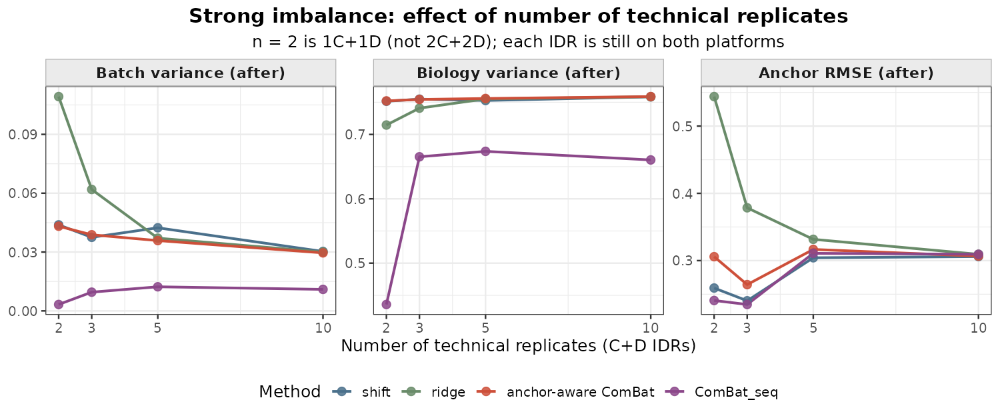
</p>

At **n = 2 (1C+1D)** ridge is weak and `ComBat_seq` collapses biology
(0.704 → 0.436); shift / anchor-aware ComBat remain stable. By **n = 10** the three anchor
methods converge.

**anchor-aware ComBat vs ComBat_seq at n = 2** (overall title + per-panel titles):

<p align="center">
  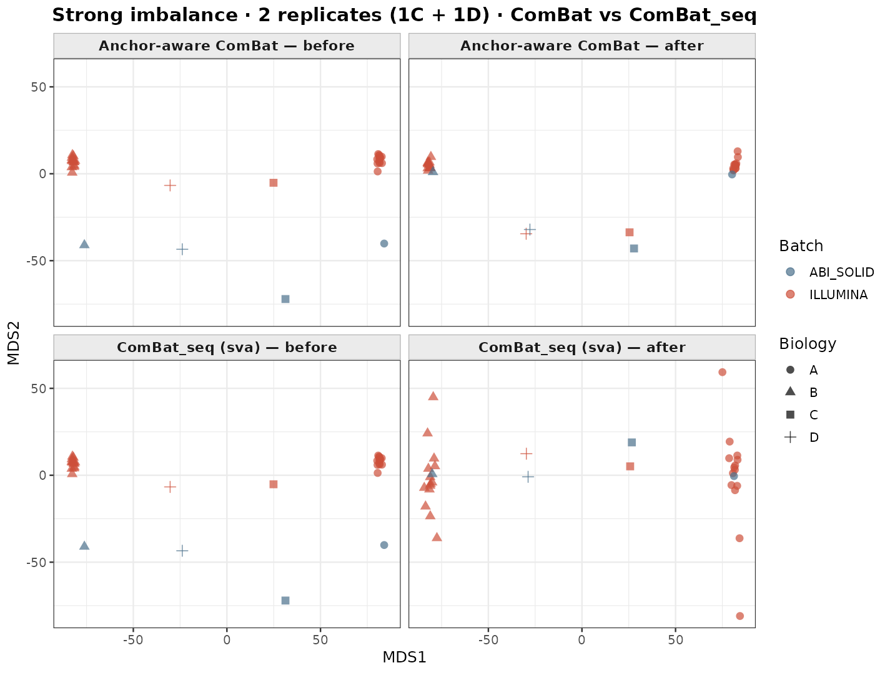
</p>

## Correction methods

All methods work on the log scale internally (log1p-CPM if counts) and return
data in the input scale. Optional `ref_batch` leaves one batch unchanged.

| Method | Function | Description |
|--------|----------|-------------|
| `"shift"` | `correct_shift()` | Location offsets from anchors (`center = "mean"` / `"median"`) |
| `"ridge"` | `fit_anchor_ridge()` / `apply_correction_ridge()` | Ridge on batch dummies, **anchors only** |
| `"combat"` | `correct_combat_anchor()` | **anchor-aware ComBat** (EB shrinkage; not original ComBat) |
| *(external)* | `sva::ComBat_seq()` | Original ComBat-seq for counts; pass `group` to protect biology |

| Situation | Prefer |
|-----------|--------|
| Default / first pass | **shift** (`mean`) |
| Noisy anchors | **shift** (`median`) |
| Few Replicates | **shift** or **anchor-aware ComBat** (not ridge / ComBat_seq alone) |
| Many Replicates (≥5–10) | **ridge** or **anchor-aware ComBat** |
| Balanced + trusted biology labels | **ComBat_seq** no need of replicates |
| Strong imbalance / confounding | **anchor methods** |

## Input types

| `input_type` | When |
|--------------|------|
| `"auto"` | Heuristic (integer-like → counts; floats often mis-labeled — prefer `"counts"`) |
| `"counts"` | Raw / count-like, including decimal expected counts |
| `"log"` | Already on the scale to correct |

## Extended utilities for QC

Beyond batch correction, the package ships helpers for common RNA-seq quality
checks and for building synthetic replicate libraries. These are independent of `anchor_correct()`.

Figures below are **real outputs** from the **PRECISESADS** project cohort
(large multi-center autoimmune RNA-seq study), shown as illustrative QC
examples, not from the bundled SEQC toy data.

### Outlier samples (`detect_outliers_pca_mds`)

Iteratively flags samples that sit far from the cohort in **PCA or MDS** space
(beyond `n_sd` standard deviations on either embedding). After each pass,
outliers are removed and the embedding is recomputed until no new outliers
appear (or `max_iterations` is reached). Useful before correction to drop
obviously broken libraries.

Returns PCA/MDS plots, a per-sample filter table, and the outlier IDs.
Needs **ggplot2**.

```r
outliers <- detect_outliers_pca_mds(counts, n_sd = 5, verbose = TRUE)
outliers$outliers
outliers$pc_plot
outliers$mds_plot
```

**PRECISESADS example** (`n_sd = 5`): most libraries form a tight cloud of
**Passed** samples; a minority are flagged as **Outlier**. In PCA, extreme
points sit far on PC1/PC2, but a few red points can still fall near the center,
 they fail on higher PCs used by the iterative rule, not only on the 2D view.
In MDS, outliers are pulled far along MDS1/MDS2 (including very high MDS2),
which often flags globally atypical expression profiles (failed libraries,
extreme composition, or strong technical artefacts).

<p align="center">
  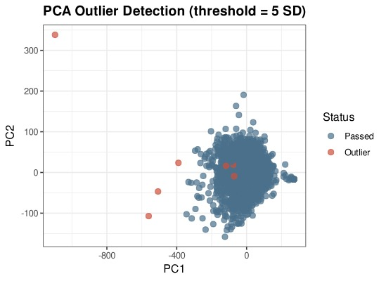
</p>
<p align="center">
  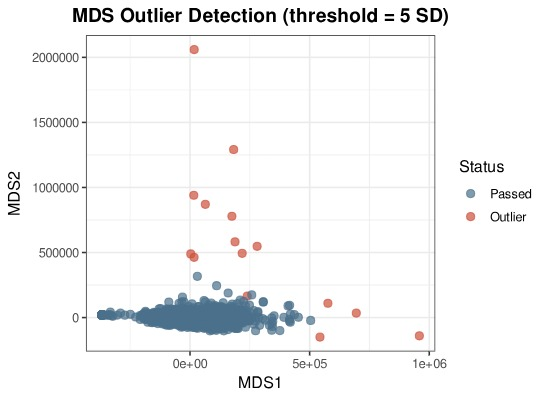
</p>

### Sex mismatch / contamination (`detect_sex_mismatch`)

Compares reported sex in metadata to expression of **XIST** and a panel of
**chrY** genes (`default_chrY_genes`). Samples are placed in an XIST–chrY
plane; a diagonal “contamination zone” (angle estimated or fixed) separates
clean male/female calls from likely swaps or mixed libraries.

Returns a status table, summary counts, CPM matrix, and a diagnostic plot.
Needs **edgeR**, **dplyr**, and **ggplot2**.

```r
sex_qc <- detect_sex_mismatch(
  counts,
  metadata = data.frame(sample_id = colnames(counts), sex = reported_sex),
  chry_genes = default_chrY_genes
)
table(sex_qc$status_table$status)
sex_qc$plot
```

**PRECISESADS example:** clean **males** sit on the chrY axis (high Y, low
XIST) and clean **females** on the XIST axis (high XIST, low Y), both
**Passed** (blue). The yellow wedge is the contamination zone: samples with
intermediate XIST and chrY signal are **Likely contaminated** (orange) or
**Contaminated and sex mismatch** (purple). Points that land on the “wrong”
axis relative to reported sex are **Sex mismatch** (red), classic label swaps
or mixed tubes. In a multi-center cohort like PRECISESADS this screen is a
fast sanity check before any biology or batch analysis.

<p align="center">
  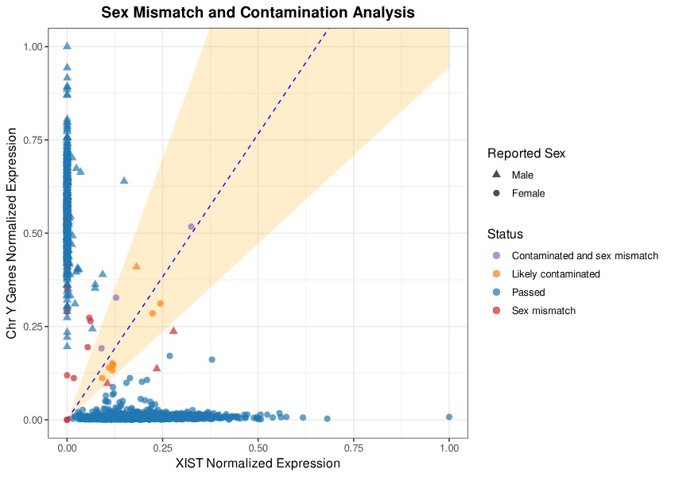
</p>

### RNA–DNA genotype concordance (`vcf_compare_fast`)

Pairwise comparison of **RNA-seq VCFs** against **DNA/genotype VCFs** to catch
sample swaps and mislabeling. For each RNA-DNA pair it counts shared vs unique
variants, optionally corrects REF/ALT swaps, and classifies pairs with a
shared-score threshold. Can run in parallel (`n.cores`).

Returns pairwise statistics, a filter/summary table, genotype matrices, and a
combined bar/box/pie plot. Needs **vcfR**, **dplyr**, **foreach** /
**doParallel**.

```r
vcf_qc <- vcf_compare_fast(
  rna_dir = "path/to/rna_vcfs",
  dna_dir = "path/to/dna_vcfs",
  n.cores = 4,
  shared_score_threshold = 0.6
)
vcf_qc$summary
vcf_qc$plot
```

**PRECISESADS example** (threshold ≈ 0.6): left panels show per-RNA-sample SNP
depth and concordance scores against DNA references (boxplots + best/matching
IDs). Green points are correct same-ID matches above the threshold; pink
highlights a best match to a **different** DNA ID (possible swap). The pie
chart summarizes the cohort: most samples **Pass – High concordance**, with
non-trivial fractions of **No matching DNA sample**, low concordance, or
multiple matches, typical of a large clinical study where genotype coverage
is incomplete and occasional mislabels occur.

<p align="center">
  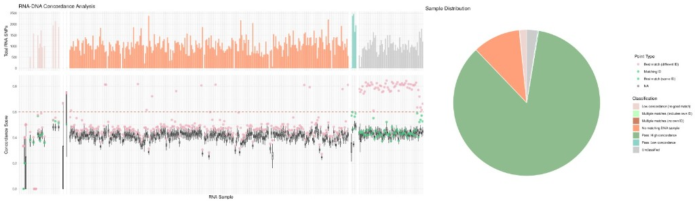
</p>

### Bootstrap FASTQ replicates (`generate_bootstrap_fastq`)

Resamples reads **with replacement** from FASTQ/FASTQ.gz inputs to create
pseudo-replicate libraries (single- or paired-end). Optionally merges several
inputs first (`merge_inputs = TRUE`), then writes `reps` files each containing
a `percent` fraction of reads. Handy for stress-testing pipelines or simulating
extra technical replicates when true anchors are scarce.

Needs **ShortRead** (and **parallel** for `use_parallel = TRUE`).

```r
generate_bootstrap_fastq(
  input_dir = "path/to/fastq",
  file_names = c("sampleA", "sampleB"),
  output_dir = "path/to/out",
  reps = 3,
  percent = 0.5,
  seed = 1
)
```

## API overview

| Function | Role |
|----------|------|
| `anchor_correct()` | Unified entry point |
| `correct_shift()` / `correct_combat_anchor()` | Shift / anchor-aware ComBat |
| `fit_anchor_ridge()` / `apply_correction_ridge()` | Ridge |
| `assess_correction()` / `merge_assessments()` | Metrics |
| `mds_samples()` / `plot_mds_before_after()` | MDS (`title=` for overall title) |
| `detect_outliers_pca_mds()` | Extended QC: PCA/MDS outliers |
| `detect_sex_mismatch()` / `default_chrY_genes()` | Extended QC: sex / contamination |
| `vcf_compare_fast()` | Extended QC: RNA–DNA VCF concordance |
| `generate_bootstrap_fastq()` | Extended QC: bootstrap FASTQ replicates |

## Requirements

1. Numeric matrix, **genes × samples**.
2. `batch` and `sample_id` of length `ncol(x)`.
3. Some `sample_id` values in **≥ 2 batches** (anchors).

## Citation / license

**GPL-3** — see [`LICENSE`](LICENSE) and `DESCRIPTION`.

```
Package: anchorCorrectR
Authors:
  María Rivas-Torrubia <maria.rivas@genyo.es>
  Ana Brescia-Zapata <ana.brescia@genyo.es>
  Guillermo Barturen <gbarturen@ugr.es>
License: GPL-3
```
